# Vue Todolist

Github Pages를 이용해 배포한 [vue-todolist 보러가기](https://hye0ngyun.github.io/vue-todolist/)

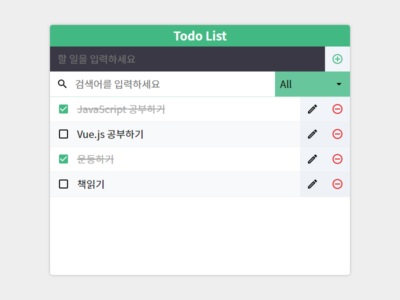

## Project Goal

- Vue.js 학습
- Vite(frontend project manager) 학습
- npm 사용법 학습
- scss 문법 학습
- 간단한 리스트관리(CRUD)와 등록된 일정을 검색어, 옵션을 통해 필터링하는 기능이 있는 Todolist 앱 구현
- js localStoarge 이용해 브라우저 캐시로 리스트 정보 유지

## Table of Contents

- [Vue Todolist](#vue-todolist)
  - [Project Goal](#project-goal)
  - [Table of Contents](#table-of-contents)
  - [Using Skills & Stacks](#using-skills--stacks)
  - [Project Description](#project-description)
    - [리스트 추가](#리스트-추가)
    - [리스트 수정](#리스트-수정)
    - [리스트 삭제](#리스트-삭제)
    - [리스트 체크](#리스트-체크)
    - [리스트 필터링1(search)](#리스트-필터링1search)
    - [리스트 필터링2(option)](#리스트-필터링2option)
    - [정보 저장 (localStorage)](#정보-저장-localstorage)

## Using Skills & Stacks

- javascript

  - localStorage를 이용해 브라우저 캐시로 정보 유지

- Vue.js

  - `v-bind`, `v-on `,`v-if`, `v-for`, `v-model`, `v-show` 등 Vue directive를 이용한 마크업과 화면 렌더링
  - component를 기반으로 `props`, `$emit`을 이용해 상위 컴포넌트와 하위 컴포넌트간의 데이터 및 이벤트 전달
  - component별 scoped style로 각 component 범위의 style 작성(하나의 style sheet나, 여러개의 style sheet를 관리할때보다 관리가 유용)
  - File Style - SFC(Single-File Components)
    - 파일 확장명 `*.vue`
  - API Style - Options, Composition both

- SCSS

  - SCSS문법을 이용한 효율적인 style 작성

- Vite
  - Vue3 project manager인 Vite사용, 옵션 학습

## Project Description

프로젝트 기능 소개

### 리스트 추가

할 일 입력란에 할 일을 입력한 후 `enter`를 입력하거나 오른쪽의 버튼을 클릭하면 리스트에 입력한 내용이 추가됩니다.

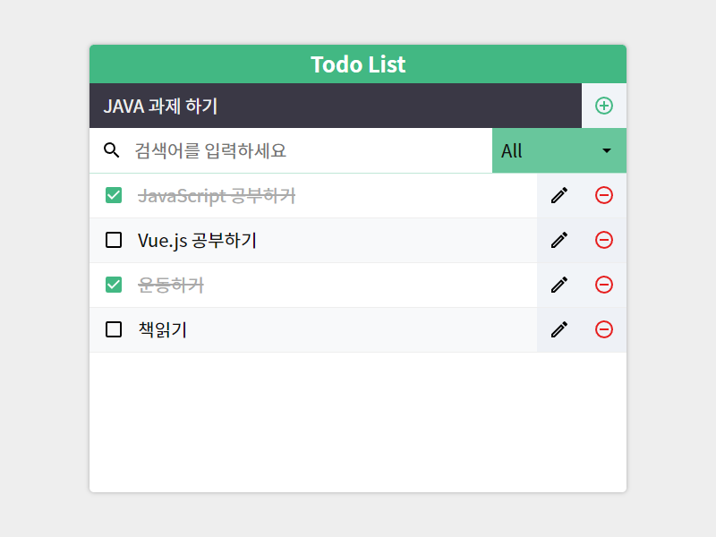
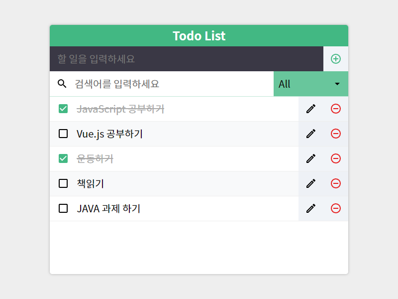

### 리스트 수정

리스트의 오른쪽의 버튼을 클릭하면 수정하기 모달 창이 나타납니다.  
수정하기 모달창에는 해당 리스트의 내용이 input value 값으로 들어가 있으며  
내용을 수정하고 수정 버튼을 누른 경우 리스트에 변경된 내용이 반영됩니다.

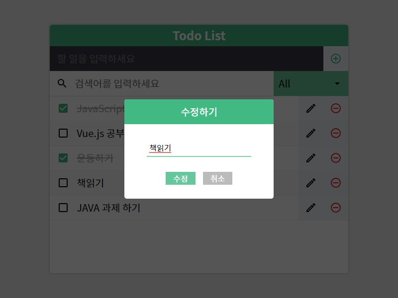
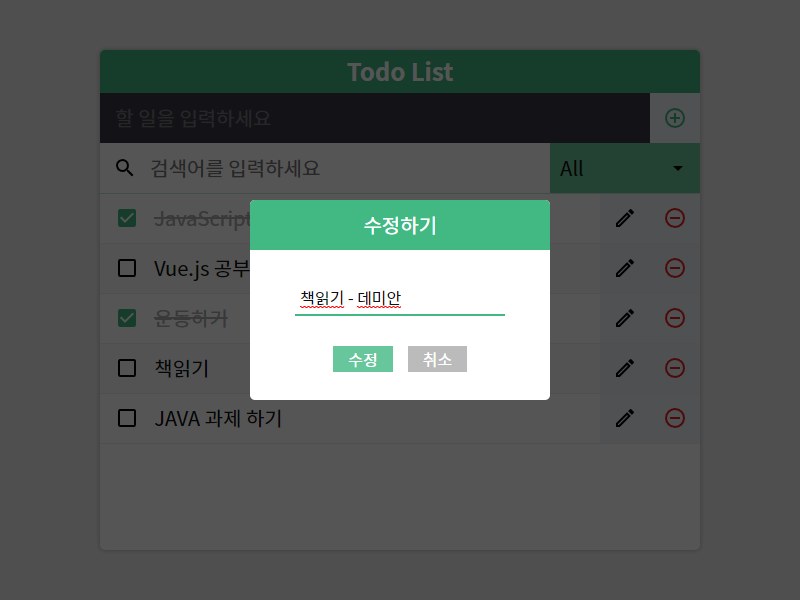
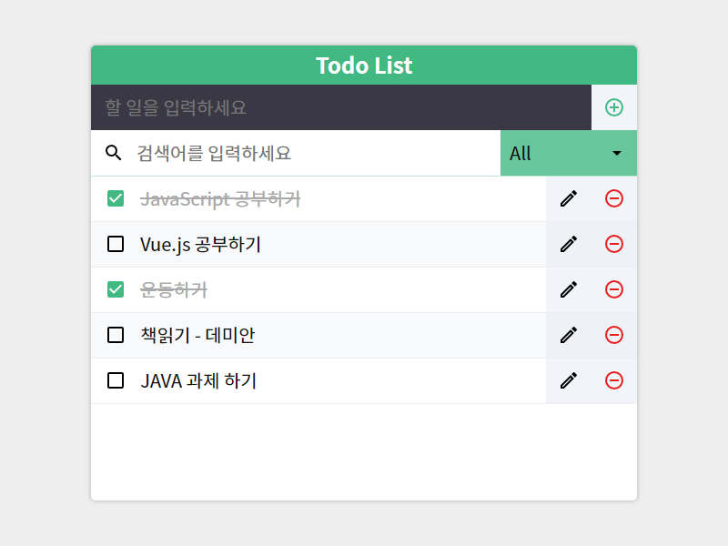

### 리스트 삭제

리스트의 오른쪽의 버튼을 클릭하면 해당 리스트가 삭제됩니다.
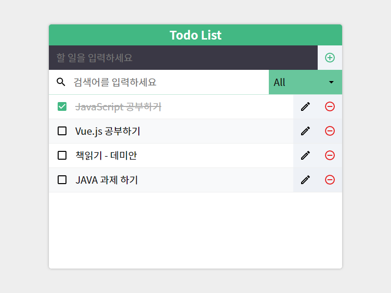

### 리스트 체크

리스트 왼족의 (`false`)체크박스를 클릭하면 해당 리스트의 체크박스가 (`true`)로 변경됩니다.  
체크박스가 `true`로 변경된 경우 리스트의 내용에 완료 표시로 내용의 `color`와 `text-decoration`이 변경됩니다.
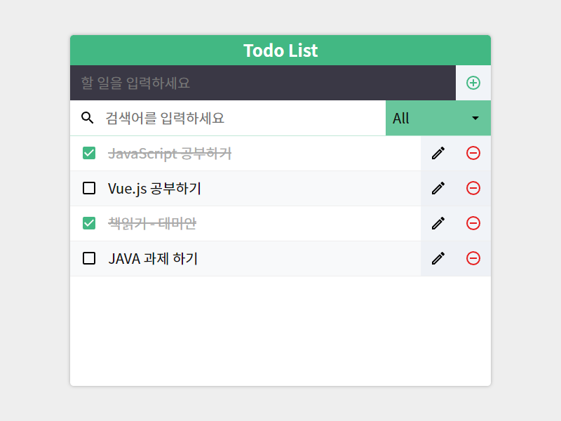

### 리스트 필터링1(search)

검색어 입력란에 검색어를 입력하면 검색어로 필터링해서 리스트에 일치하는 문자열이 있는 경우에 해당 리스트를 보여줍니다.  
옵션 필터링과 함께 사용 가능하며, 함께 사용한 경우 두 가지 필터를 모두 만족한 리스트를 보여줍니다.
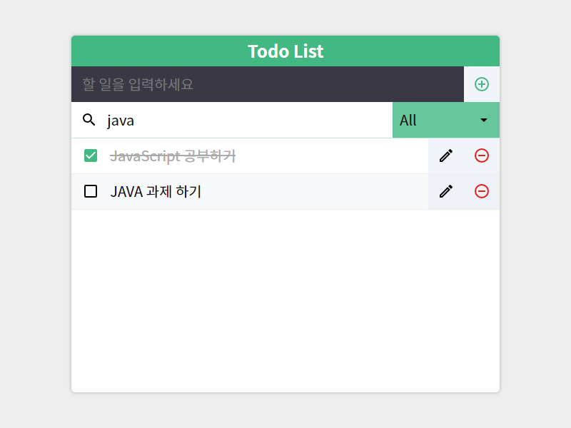

### 리스트 필터링2(option)

옵션 선택으로 All(전체), Complete(check: true), Incomplete(check: false)가 있으며, 각 옵션을 선택하면 옵션과 일치하는 리스트를 보여줍니다.  
옵션 필터링과 함께 사용 가능하며, 함께 사용한 경우 두 가지 필터를 모두 만족한 리스트를 보여줍니다.
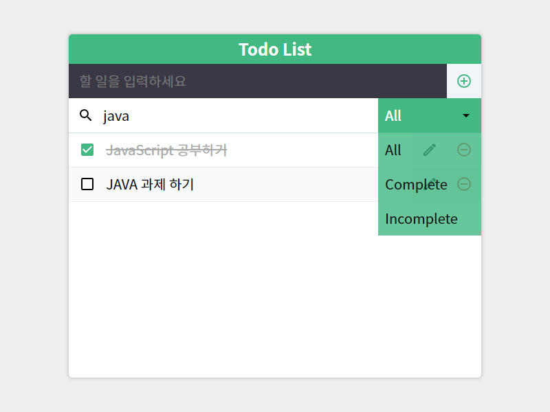
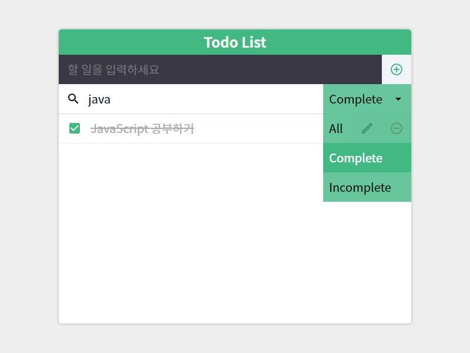

### 정보 저장 (localStorage)

js 내장 객체인 window에 포함된 속성으로 접속한 url의 로컬 저장 공간에 접근할 수 있는 Storage 객체를 이용합니다.  
localStorage를 이용해서 브라우저 세션이 종료(창 종료)되어도 정보가 유지돼 실질적인 Todo List로 활용할 수 있습니다.
